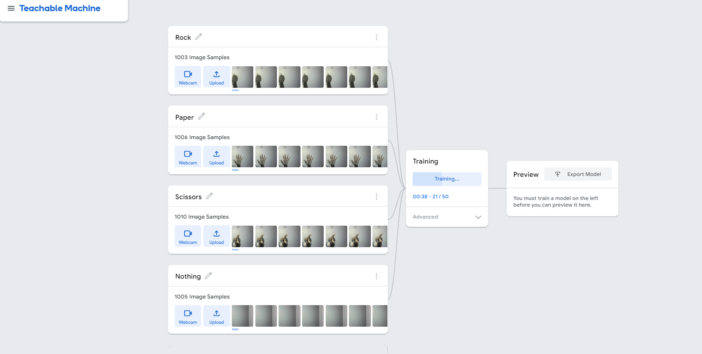

# computer-vision-rock-paper-scissors

This file contains a project called computer vision rock paper scissors where the aim is create a rock-paper scissors games which will compare the user input with the computers choice. The computers choice was developed by creating a computer vision system model on teachable-machines.

Milstone 1 - Create the computer vision system

Teachable-Machine was used to creat the model. This consisted of creating four classes which represent Rock,Paper,Scissors and Nothing. for each class I took roughly 1000 images to build the model.

Once all the images were taken the model was trained and downloaded from the "Tensorflow" tab. the model is labbeled as "keras_model.h5" and contains a "labels.txt" file which contains the classes with the corresponding index.

Milstone 2 -Setting up the virtual environment

In order to run the model a virtual environment with the correct installed libaries needed to be set up. The required libaries were opencv-python, tensorflow and ipykernel.

The conda create -n command was inputted into the bash terminal on VSCode to create the virtual environment and , conda pip install(pip install) commands were inputted to install the required libraries and its depedencies in the virtual environment.

pip list > requirments.txt and conda env export > env.yaml commands were inputted into the bash terminal to copy over the required libaries and dependencies. These file enables any other user that wants to use your computer to easily install these exact dependencies.

Milestone 3 - Create a Rock-Papper-Scissors game

The object of this Milestone is to create a python script that will simulate a Rock-Papper-Scissors game that will ask for a user input and then compare the user input against the computers choice to show the winner.

The first step was to write the import random module to pick a random option between rock, paper, and scissors and the input function to get the user's choice.

A get_user choice functions was written which will take in the users choice. The user choice input  was placed in a while loop which asks the user to enter either Rock,Papper or Scissors. If the user enters one of these options the users choice will be returned and stored as a string variable. The while loop will continue to run until the user input is correct.

A get_computer_choice function was written which will pick a random option from a list which contains strings called Rock,Paper,Scissors and return a choice and store as a string variable.

A get_winner function was written which will contain if-elif-else statements to descide the winner between the user and winner based on the classic rules of rock,paper,scissors. The arguments passed through the parameters of the get_winner function are the variables stored from the get_user_choice function and get_computer_choice function.

A play()  function was written which contains the get_user_choice, get_computer_choice and get_winner function.

Mileston 4 - Use the camera to play  Rock - Papper Scissors

The first step was to code import  the cV2 module from the keras_model. This will allow the capture frame which will take in the user input to pop up during each run. The import numpy as np and random were also written in order for the code to run.

play_game!
A define play_game function was created to which will contain the main game loop. The main code from the model  was wrapped into this function and a get_prediction function was created that will return the output from the model.

get_prediction!
The output of the model is a list of probabilities for each class (Rock,Papper,Scissors,Nothing). A list labelled choices which contained the four classes was created. in order to choose the highest probability the prediction was stored in a highest index varible which contained the np.argmax function. The will pick the highest probability and was stored in in a user_choice variable. As each class corresponds to the corresponding value (e.g 0 - Rock) the user_choice variable contains the choices list which is indexed based on the highest_index. This will convert high probablity into the corresponding class.

def get_computer_choice!

the get_computer_choice function was created to return the random computer choice using the choices variable. The computer choice variable is cantains the random.choice function with an index between [0:3]. This is to ensure the computer choice does not choose "Nothing" in the choices list.

You need to pick the class with the highest probability. So, for example, assuming you trained the model in this order: "Rock", "Paper", "Scissors", and "Nothing",
first step was to create a get_prediction function in order to capture the prediction 